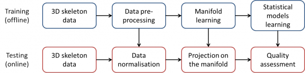
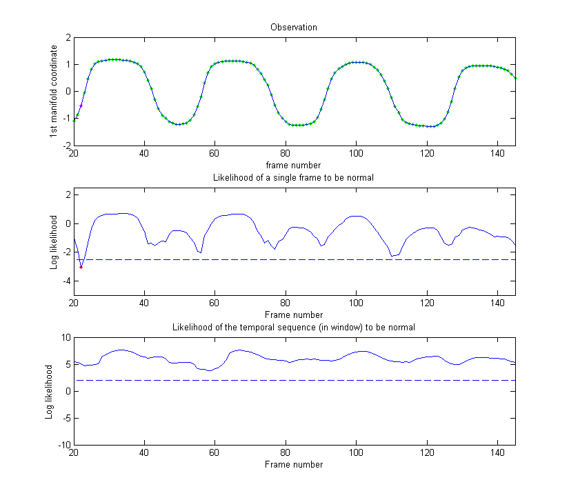
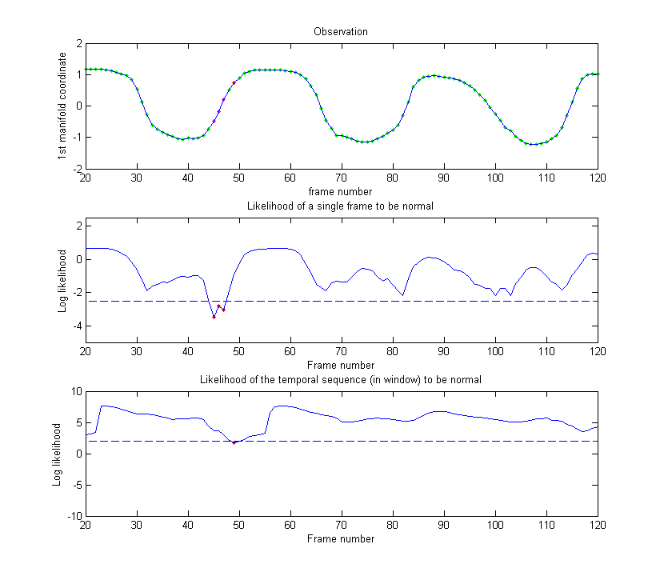
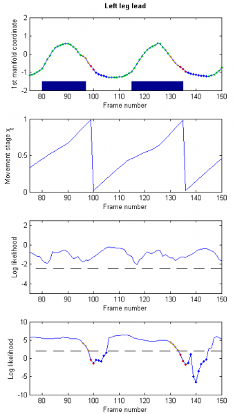
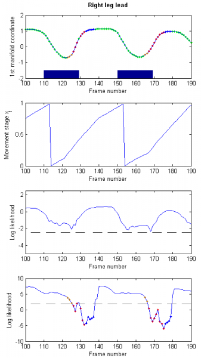
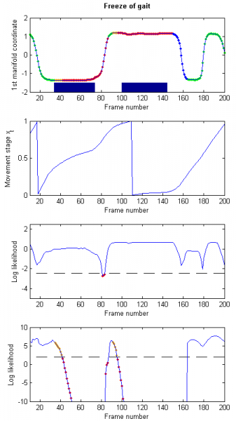
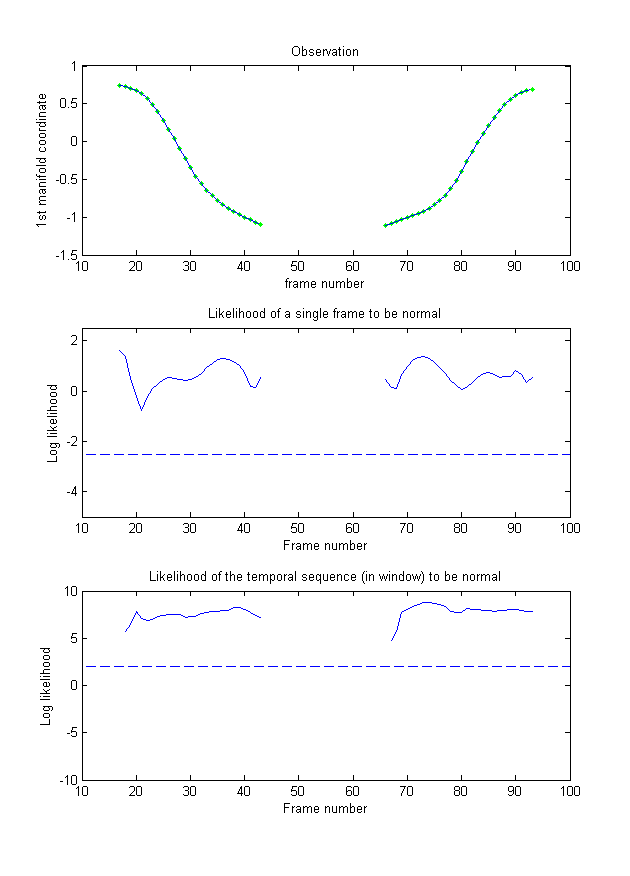
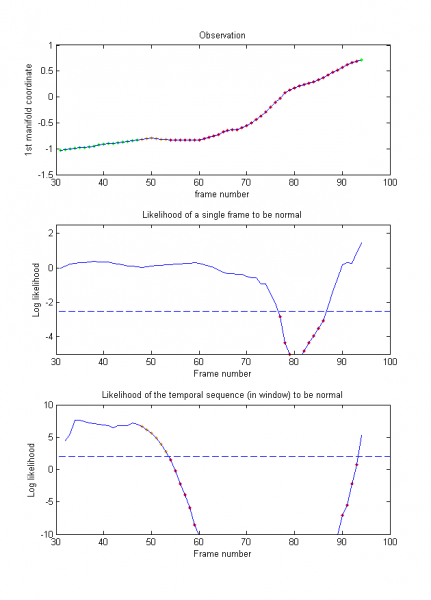
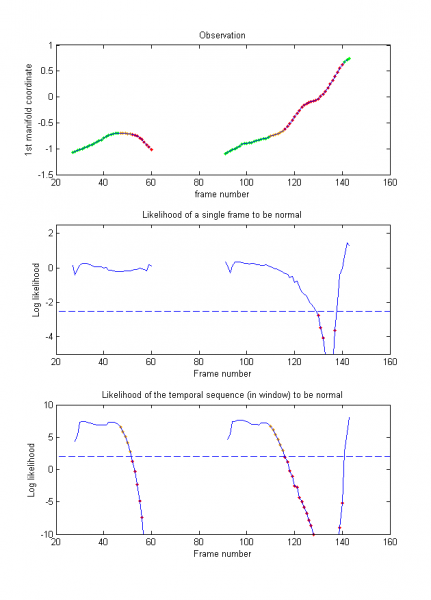

2013-2016

Summary 
======

The objective of this project is to evaluate the quality of human movements from visual information which has use in a broad range of
applications, from diagnosis and rehabilitation to movement optimisation in sports science. Observed movements are compared with a model
of normal movement and the amount of deviation from normality is quantified automatically.

## Description of the proposed method

The figure below illustrates the pipeline of our proposed method.

### Skeleton extraction

We use a Kinect camera, that measures distances and provides a depth map of the scene instead of the classic RGB image.
A skeleton tracker [1] can use this depth map to fit a skeleton on the person being filmed. We then normalise the skeleton to compensate
for people having various heights. This normalised skeleton is the basis of our movement analysis technique.

### Robust dimensionality reduction

A skeleton contains 15 joints, forming a vector of 45 coordinates. Such vector has a quite high dimensionality but also redundant
information. We use a manifold learning method, Diffusion Maps [2], to reduce the dimensionality and extract the significant information
from this skeleton.

Skeletons extracted from depth maps tend to suffer from a high amount of noise and outliers. Therefore, we modify the original Diffusion
Maps [2] to add the extension that Gerber et al. [3] proposed for dealing with outliers in Laplacian Eigenmaps that are another type of
manifold.

Our manifold provides us with a new representation $\mathbf{Y}$ of the pose, derived from the normalised skeleton, with a much lower
dimensionality (typically 3 dimensions instead of the initial 45) and significantly less noise and outliers. We use this new pose feature
$\mathbf{Y}$ to assess the quality of the movement.

### Assessment against a statistical model of normal movement

We build two statistical models from our new pose feature, which describe respectively normal *poses* and normal *dynamics*. These models
are represented by probability density functions (pdf) which are learnt, using Parzen window estimators, from training sequences that
contain only normal instances of the movement.

The pose model is in the form of the pdf $f_{Y}\left(y\right)$ of a random variable $Y$ that takes as value $y=\mathbf{Y}$ our pose feature
vector $\mathbf{Y}$. The quality of a new pose $y_t$ at frame $t$ is then assessed as the log-likelihood of being described by the pose
model, i.e. $$\mbox{llh}_{\mbox{pose}}= \log f_{Y}\left(y_t\right) \; .$$

The dynamics model is represented as the pdf $f_{Y_t}\left(y_t|y_1,\ldots,y_{t-1}\right)$ which describes the likelihood of a pose $y_t$
at a new frame $t$ given the poses at the previous frames. In order to compute it, we introduce $X_t$ with value
$x_t \in \left[0,1\right]$, which is the stage of the (periodic or non-periodic) movement at frame $t$. Note, in the case of periodic
movements, this movement stage can also be seen as the phase of the movement’s cycle. Based on Markovian assumptions, we find that
$$ f_{Y_t}\left(y_t|y_1,\ldots,y_{t-1}\right) \approx f_{Y_t}\left(y_t|\hat{x}_t\right) f_{X_t}\left(\hat{x}_t|\hat{x}_{t-1}\right) \; ,$$
with $\hat{x}_t$ an approximation of $x_t$ that minimises $f_{\left\{X_0,\ldots,X_t\right\}}\left(x_0,\ldots,x_t|y_1,\ldots,y_t\right)$.
$f_{Y_t}\left(y_t|x_t\right)$ is learnt from training sequences using Parzen window estimation, while $f_{X_t}\left(x_t|x_{t-1}\right)$
is set analytically so that $x_t$ evolves steadily during a movement. The dynamics quality is then assessed as the log-likelihood of the
model describing a sequence of poses within a window of size $\omega$:
$$\mbox{llh}_{\mbox{dyn}} \approx \frac{1}{\omega} \sum_{i=t-\omega+1}^{t} \log\left( f_{Y_i}\left(y_i|x_i\right) f_{X_i}\left(x_i|x_{i-1}\right) \right)\; .$$

Two thresholds on the two likelihoods, determined empirically, are used to classify the gait being normal and abnormal.
Thresholds on the derivatives of the log-likelihoods allow refining the detections of abnormalities and of returns to normal.

## Results
### Gait on stairs

In order to analyse the quality of gait of subjects walking up stairs, we build our model of normal movement using 17 training sequences
from 6 healthy subjects having no injury or disability, from which we extract 42 gait cycles.

We first prove the ability of our model to generalise to the gait of new subjects by evaluating the 13 normal gait sequences of 6 new
subjects. As illustrated in the figures below, the normal gaits of new persons are well represented by the model, with the two likelihoods
(middle and bottom rows) staying above the thresholds (dotted lines). In only one sequence out of all 13 did the likelihood drop slightly
under the threshold (frames 45–47 of the right-hand side figure) due to particularly noisy skeletons.

 

Next, we apply our proposed method to three types of abnormal gaits, illustrated in the next figures:
* “Left leg Lead” (LL) abnormal gait: the subjects walk up the stairs always initially using their left leg to move to the next upper
step (left-hand side figure below).
* “Right leg Lead” (RL) abnormal gait: the subjects walk up the stairs always initially using their right leg to move to the next upper
step (middle figure below).
* “Freeze of Gait” (FoG): the subjects freeze at some stage of the movement (right-hand side figure below).

In all three cases, the pose of the subject is always normal, but its dynamics is affected by either the use of the unexpected leg
(LL and RL) or by the (temporary) complete stop of the movement.

  

In our tests, these abnormal events are detected by our method with a rate of 0.93, with the likelihood dropping at all but 2 gait cycles
in the LL and RL cases, and during the stops in the FoG case. Table 1 summarises the detection rates of abnormal events by our method.

Type of event|Number of occurences|False Positives|True Positives|False Negatives|Proportion missed
---|:---:|:---:|:---:|:---:|:---:
LL|21|0|19|2|0.10
RL|25|0|23|2|0.08
FoG|12|2|12|0|0
All|58|2|54|4|0.07

### Sitting and standing

We also apply our proposed method to the analysis of sitting and standing movements. Two separate (bi-component) models are built, to
represent sitting and standing movements respectively. They are executed concurrently, and their analyses are triggered when their
respective starting conditions are detected. We use the very simple starting condition of the first coordinate of $\mathbf{Y}$ staying
at its starting value for a few frames, and then deviating. Our stopping condition is similar.

For our experiments, a qualified physiotherapist simulates abnormal sitting and standing movements, such as a loss of balance while 
standing up that leads to an exaggerated inclination of the torso, as illustrated in the figures below. The left-hand side figure shows normal sitting and standing movements. The middle figure shows an abnormal standing movement: the subject loses their balance and leans forward. The right-hand side figure shows a difficult standing movement: the subject fails on their first attempt to stand up. This failure is detected and the tracking stops. It resumes on the second attempt, and detects the torso leaning forward exaggeratedly.

  

### Sport boxing

We analyse boxing movements consisting of a cross left punch (a straight punch thrown from the back hand in a southpaw stance) and a
return to initial position. We use the same strategy than for sitting and standing movements, with two separate models that are 
triggered iteratively and automatically when their respective starting conditions are observed.

In our testing sequence, the subject alternates between 3 normal and 3 abnormal punches. Different types of abnormalities that are 
typical beginner mistakes are simulated for each set of 3 abnormal punches. As in previous experiments, abnormal movements are correctly
detected, as well as return to normality. Note that in this experiment, most abnormal movements are due to a wrong pose of the subject
and therefore trigger strong responses from the pose model. The level of abnormality is also quantified by the variations of 
$\mbox{llh}_{\mbox{pose}}$ and $\mbox{llh}_{\mbox{seq}}$ that correspond to different amplitudes of pose mistakes. For example,
non-rotating hips affect the whole body thus they trigger a stronger response than a too high punching elbow.

## References

[1] OpenNI skeleton tracker. URL http://www.openni.org/documentation.

[2] R. R. Coifman and S. Lafon. Diffusion maps. Applied and computational harmonic analysis, 21(1):5–30, 2006

[3] S. Gerber, T. Tasdizen, and R. Whitaker. Robust non-linear dimensionality reduction using successive 1-dimensional Laplacian eigenmaps. In Proceedings of the 24th international conference on Machine learning, pages 281–288. ACM, 2007

**Role in the project:**  Post-doctoral researcher

**Paper:** [Adeline Paiement, Lili Tao, Sion Hannuna, Massimo Camplani, Dima Damen, Majid Mirmehdi, Online quality assessment of human movement from skeleton data. Proceedings of British Machine Vision Conference (BMVC), September 2014](https://research-information.bris.ac.uk/files/43598824/bmvc14_revised.pdf)

**Code:** [Download here](Code_for_sharing.zip)
